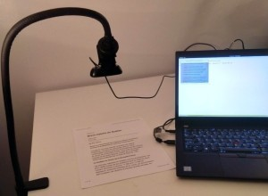
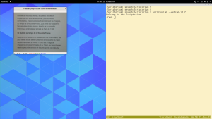

# Scriptorium

Scriptorium targets Python 3.7 (mypy and OpenCV weren't ready for 3.8 when I wrote this).

Scriptorium is a very rough demo of an OCR-based reading assistant. It's meant to accompany paper dictionary and pen-and-notebook reading methods, not to replace them. However, dictionary backends can easily be added to the code.

## Setup

[DAWG](https://github.com/pytries/DAWG) must be installed from source. Everything else is covered by setup.py and `requirements*.txt`.

Quick setup guide, assuming the user has a Python 3.7 virtualenv created and activated:

```
$ git clone https://github.com/pytries/DAWG && cd DAWG/ && pip install -e . && cd ../
$ git clone https://github.com/sevagh/Scriptorium && cd Scriptorium && make init && cd ../
```

You can now launch `Scriptorium` from your virtualenv. My cheap testing rig is a Logitech C270 with a mounting arm. The camera is so bad that it makes the experiment impractical... but it works enough to demonstrate the concept:



## Usage

Launch Scriptorium:



```
(Scriptorium) sevagh:Scriptorium $ Scriptorium --webcam-id 7 --workdir ./test-scriptorium-dir
Welcome to the Scriptorium
(Cmd)
```

The cv2 camera window will take a snapshot and perform OCR (using [tesseract](https://github.com/madmaze/pytesseract)) when any key is pressed. From the Scriptorium command line, there are several commands to interact with the dictionary built via OCR.

`list` discovered words:

```
Welcome to the Scriptorium
(Cmd) list
Contrée du Nouveau Monde le Québec est depuis longtemps une terre de rencontres plus ou moins Conflictuelies S'abord entre ies Amérindiens et Francais au temps la Nouvelie-France puis les Canadiens frangais ot Anglo-Saxons partir conquéte DrRannique entéringe par trate Paris Le Nouvelle-France Les premiers habitants sont vielles traces Ge leur présence dans vallée Saint
```

`look` displays a single word (exact match), and paths to saved images (if you passed a valid `--workdir`):

```
(Cmd) look Monde
Monde
  seen 2 times
  looked up 1 times

appears in:
        ./test-scriptorium-dir/frame-15-11-2019-07-31-05-5Y8Y01.jpg
        ./test-scriptorium-dir/frame-15-11-2019-07-31-09-Y40Y8G.jpg
```

`define` allows you to define a word:

```
(Cmd) define Monde world
(Cmd) look Monde
Monde
  seen 2 times
  looked up 2 times
  definition:  world

appears in:
        ./test-scriptorium-dir/frame-15-11-2019-07-31-05-5Y8Y01.jpg
        ./test-scriptorium-dir/frame-15-11-2019-07-31-09-Y40Y8G.jpg
```

`fuzzy` leverages a [CompletionDAWG](https://dawg.readthedocs.io/en/latest/#dawg-and-completiondawg) to do prefix matching. The DAWG is recreated every time a snapshot event occurs in the cv2 window (signaling that a new page has been scanned with OCR).

```
(Cmd) fuzzy a
a ans au
(Cmd) fuzzy d
dans de depuis du
```

`add` allows you to add your own word, with optional definition:

```
(Cmd) add hello goodbye
(Cmd) look hello
hello
  seen 1 times
  looked up 1 times
  definition:  goodbye
```

`recentk` uses a [splay tree](./scriptorium/splay.py) to show the most recent `k` lookups and defines. The idea is to help you discover which words you're interacting with the most (and presumably have the most difficulty with):

```
(Cmd) recentk 3
hello
  seen 1 times
  looked up 2 times
  definition:  goodbye
Monde
  seen 2 times
  looked up 3 times
  definition:  world

appears in:
        ./test-scriptorium-dir/frame-15-11-2019-07-31-05-5Y8Y01.jpg
        ./test-scriptorium-dir/frame-15-11-2019-07-31-09-Y40Y8G.jpg
```

When exiting, if a valid `--workdir` was provided, a [BytesDAWG](https://dawg.readthedocs.io/en/latest/#bytesdawg) is created and persisted to the file `${workdir}/scriptorium.dawg`. When loading Scriptorium from the same workdir, the internal dictionary is repopulated from the BytesDAWG with all the data (lookups, definitions, paths) intact.

The performance characteristics of an instance of Scriptorium populated with 100,000 words (a typical novel size) aren't great. For best performance, you should probably create a new Scriptorium workdir per reading session (chapter, etc.)
